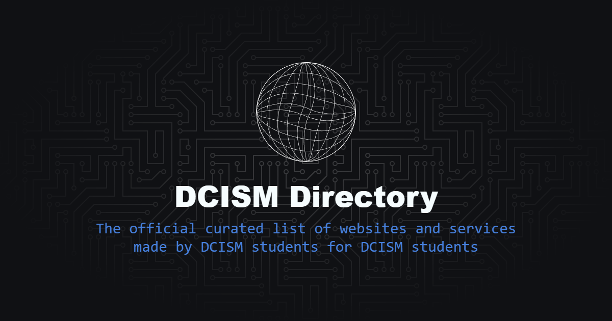

<figure>
  
  <figcaption style="text-align: center; font-style: italic;">
  The official curated list of websites and services made by DCISM students for DCISM students
  </figcaption>
</figure>

## How to Contribute

1. Fork this repo and add your information to the **BOTTOM** of `projects[]` in `/src/data/projects.ts` following this format:
   ```ts
   {
    id: 1, // incremented from the previous id
    title: 'Project 1', // name of your website
    image: 'https://your-website.dcism.org/opengraph-image.png', // url of your deployed website's opengraph image
    creator: 'John Doe', // your name
    description: 'My website solves world hunger!', // short description of what your website does
    url: 'https://project1.example.com', // url of your deployed website
    creatorGithubURL: 'https://github.com/johndoe', // your github URL
   },
   ```
2. Submit a Pull Request using your fork & wait patiently for maintainer approval.

### Website Guidelines

1. Your URL must link to a website or service for DCISM students, hosted on the DCISM server.
2. If your website does not have an opengraph image, then a screenshot may be used in lieu of it. Place it in the `/public/screenshots` folder and link it appropriately in the projects array.
3. Your URL must not redirect to a website that has purposes outside of providing service to the department.

If your website does not comply with any of the guidelines above for 14 days, we reserve the right to remove it without prior notice.

Likewise, the maintainers reserve the right to take down entries that are deemed to be counter-productive or harmful to the goal of this directory.

## Credits & Inspiration

We would like to thank DCISM for allowing students to host websites on their servers.
